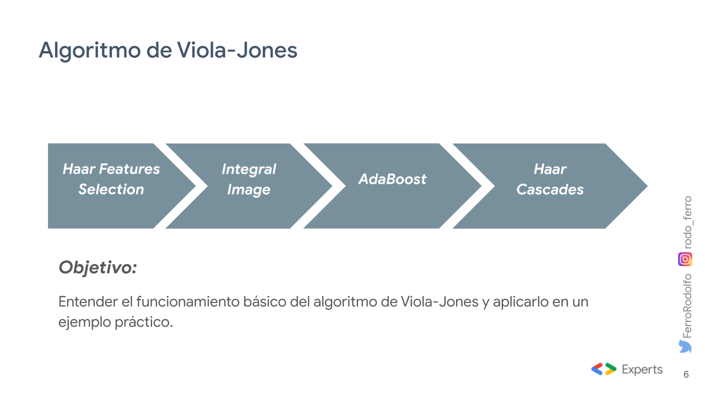

# Sesión de reconocimiento Facial

Sesión de reconocimiento facial para el Google Developer Student Club Guanajuato & Hackademy. En esta sesión explicamos el proceso completo para la detección de rostros que realiza el algoritmo de [Viola-Jones](https://www.cs.cmu.edu/~efros/courses/LBMV07/Papers/viola-cvpr-01.pdf) (2001):




Revisa los slides [aquí](https://docs.google.com/presentation/d/e/2PACX-1vR5wgAoNGyy0fhkLbYGiY2CTzh80j5ACa3hrTLU0U7feA4ZUoFLvumO4yqqLO5vwTygy8wFbcqdAoMX/pub?start=false&loop=false&delayms=3000).

Y un TikTok demostrando el funcionamiento aquí: [https://vm.tiktok.com/ZMdoMfmKM/](https://vm.tiktok.com/ZMdoMfmKM/)


## Setup

Instala OpenCV y NumPy con Anaconda:
```bash
conda install -c conda-forge opencv numpy
```

O utiliza pip:
```bash
pip install opencv-python numpy
```

Ejecuta el archivo `facedet.py`:
```bash
python facedet.py
```
